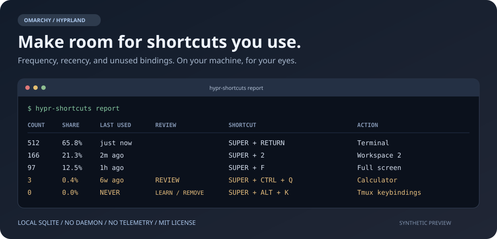

# Hypr Shortcut Tracker

**Keep the shortcuts you use. Reclaim the ones you don't. Learn the ones you miss.**

[](https://github.com/alexpomsft/hypr-shortcut-tracker/actions/workflows/ci.yml)
[](https://github.com/alexpomsft/hypr-shortcut-tracker/releases)
[](LICENSE)

A small, local-first shortcut-usage tracker for **Omarchy's Lua-based Hyprland
configuration**. See how often you invoke each shortcut, when you last used it,
and which configured bindings have never been used.



*Illustrative preview, not a capture of anyone's usage history.*

No background daemon, no account, no network requests, and no ordinary-key
logging. Just a Lua adapter, Python's standard library, and a local SQLite file.

## At a glance

| Question | Report |
| --- | --- |
| Which shortcuts do I actually use? | Counts and percentage of all tracked invocations |
| What have I used lately? | Relative last-used time; exact timestamps in JSON/CSV |
| What could I learn or repurpose? | Never-used and stale shortcuts, with action descriptions |
| What changed in my configuration? | A refreshed catalog on each config load; removed shortcuts retain their history |

Review hints are suggestions, not automatic edits. A rarely used lock,
emergency, or accessibility shortcut may still be worth keeping.

## Requirements and compatibility

- Omarchy with its **Lua-based** Hyprland config and `o.bind` helper.
- Python **3.10+** with the standard-library `sqlite3` module.
- Bash and Git for installation and updates. No `pip` packages or root access.

Live integration was tested on **Omarchy 4.0.4 / Hyprland 0.56.2**. CI checks
Python 3.10, 3.12, and 3.14, plus the Lua adapter using a stubbed Hyprland API.
Older `.conf`-based Omarchy setups and arbitrary non-Omarchy configs are not
supported.

This is a **CLI utility and Hyprland Lua hook**, not an Omarchy shell/QML plugin.
Install it using the instructions below, not `omarchy plugin add`.

## Install

Clone into a location you will keep:

```bash
mkdir -p ~/Work
git clone https://github.com/alexpomsft/hypr-shortcut-tracker.git ~/Work/hypr-shortcut-tracker
cd ~/Work/hypr-shortcut-tracker

# Review the source, then install.
./install
hyprctl reload
hyprctl configerrors
```

`configerrors` should print nothing. The installer does not reload Hyprland
itself; on setups with auto-reload, saving the config may also trigger a reload.
Keep `~/.local/bin` on your `PATH`, or invoke
`~/.local/bin/hypr-shortcuts` explicitly.

### What installation changes

| Location | Change |
| --- | --- |
| `~/.local/bin/hypr-shortcuts` | Symlink to this checkout's CLI |
| `~/.config/hypr/shortcut_tracker.lua` | Symlink to this checkout's Lua adapter |
| `~/.config/hypr/hyprland.lua` | Starts tracking before defaults load; publishes the catalog after user overrides |
| `hyprland.lua.backup-shortcut-tracker-*` | Timestamped backup before any config edit |

Installing again is idempotent. Installation and uninstallation refuse to
replace unrelated files or remove an unrecognized integration. Nothing under
`/usr/share/omarchy` is changed.

**Keep the checkout in place while installed.** The config and CLI refer to it
through symlinks. Uninstall before moving or deleting the checkout.

## Use

```bash
hypr-shortcuts report                          # Most-used first
hypr-shortcuts report --sort recent            # Most recently used first
hypr-shortcuts report --sort review            # Unused/stale first
hypr-shortcuts report --sort review --stale-days 14 --limit 20
hypr-shortcuts status
hypr-shortcuts --version
```

Reports include **COUNT**, **SHARE**, **LAST USED**, **REVIEW**, **SHORTCUT**, and
**ACTION**. `--stale-days` defaults to 30; both it and `--limit` must be positive.

| Review hint | Meaning |
| --- | --- |
| `LEARN / REMOVE` | No recorded invocation; learn it, keep it intentionally, or consider repurposing it |
| `REVIEW` | Used before, but not within the selected stale threshold |
| No hint | Used within the threshold |

`NEVER` means **no usage recorded since tracking began**, not "never used in
your life." Counts and shares are all-time totals since tracking began or was
last reset; they are not a rolling daily/weekly rate. Relative times use wall
clock time, not time spent logged in.

### Export

```bash
hypr-shortcuts report --format json > shortcuts.json
hypr-shortcuts report --format csv > shortcuts.csv
```

Exports include exact first- and last-used timestamps with a local timezone
offset, relative last-used time, count, share, description, and review hint.
Treat exported history as personal usage data; review it before sharing.

## How counting works

The Lua adapter wraps Omarchy's `o.bind` helper. It registers one additional
logging action per shortcut while leaving the original actions unchanged.
The action launches a short-lived Python process that updates a SQLite row.
There is no continuously running tracker service.

```text
Omarchy o.bind definitions
          |
          +--> Original Hyprland actions (unchanged)
          |
          +--> One logging action --> Python --> local SQLite totals

Config load --> current binding catalog --+
SQLite totals ---------------------------+--> table / JSON / CSV report
```

- Multiple actions on the same shortcut share one count and merged descriptions.
- Holding volume/brightness keys counts once per press, not per autorepeat;
  the original volume/brightness action still repeats.
- Press/release pairs such as dictation count once. An ordinary press is
  preferred when ordinary-, long-press, or release actions share a shortcut.
- Release-only and long-press-only shortcuts retain their respective trigger.
- Reloading rebuilds the catalog without stacking tracker wrappers.
- SQLite transactions and timestamp extrema preserve counts and first/last
  ordering across concurrent recording processes.

### Scope and limitations

Only bindings created through **`o.bind`** are tracked. Application-local
shortcuts and direct `hl.bind` calls, including temporary screenshot-selection
bindings, are outside its scope. Disabled or unavailable conditional defaults
are not included.

Invocations measure **shortcut triggers, not action success**. A command that
fails to launch can still count as a used shortcut. Shortcuts are identified by
their configured key string; changing that string creates a separate history
row. Changing the action behind an unchanged string retains its counts and
uses the current description.

The tracker stores aggregate totals, not a timeline of every event, so it
cannot reconstruct rolling-window activity or distinguish historical repeats
after the fact. Pre-release data from before the counting fixes is preserved
and may contain autorepeat or press/release inflation.

## Privacy and storage

The tracker itself makes **no network requests**. It stores configured key
strings, action descriptions, invocation totals, and first/last timestamps.
It does **not** collect ordinary keystrokes, typed text, clipboard content,
active-window titles, application contents, or command arguments.

Default state:

```text
~/.local/state/hypr-shortcut-tracker/
  bindings.tsv       Current shortcut descriptions
  usage.sqlite3      Counts and first/last timestamps
```

`XDG_STATE_HOME`, when set, replaces `~/.local/state`. Keep it consistent
between the Hyprland session and the shell running reports. SQLite may also
create `usage.sqlite3-wal` and `usage.sqlite3-shm` files.

State files are outside the repository, and `.gitignore` also excludes
databases and catalogs. Do not attach your database to public bug reports.

## Update, reset, and uninstall

Update from `main` after reviewing the changes:

```bash
cd ~/Work/hypr-shortcut-tracker
git pull --ff-only
hyprctl reload
hyprctl configerrors
```

For a fixed version, check out a release tag such as `v0.1.0`. Do not use
`git pull` while detached at a release tag; switch back to `main` first.

Reset only when you intentionally want to start a new observation period:

```bash
hypr-shortcuts reset
# Non-interactive, destructive to usage history:
hypr-shortcuts reset --yes
```

Reset asks for confirmation and deletes usage rows in a transaction, not the
active SQLite files. The catalog stays intact.

Uninstall from the same checkout:

```bash
./uninstall
hyprctl reload
hyprctl configerrors
```

This removes the tracker integration and symlinks, backs up config changes,
and **keeps your usage history**. Reload before removing the checkout.

## Troubleshooting

| Symptom | Check |
| --- | --- |
| `hypr-shortcuts: command not found` | Use `~/.local/bin/hypr-shortcuts`; check `PATH` and that the checkout still exists |
| Binding catalog missing | Run `./install`, reload, and check `hyprctl configerrors` |
| A shortcut is absent | Check that it uses `o.bind` and that its conditional dependency is installed |
| Everything says `NEVER` | Use a physical configured shortcut, then run `status`; synthetic virtual-keyboard input may bypass global binds |
| Install/uninstall refuses a config | Read the reported line; an unfamiliar or partially edited integration is left untouched |
| Hyprland reports config errors | Inspect the error and timestamped backup before further edits; do not reset your full Omarchy configuration |
| Database write error | Check available disk space, permissions, and consistent `XDG_STATE_HOME`; CLI errors are reported to stderr |

## Contributing

See [CONTRIBUTING.md](CONTRIBUTING.md) for local tests and change guidelines,
[CHANGELOG.md](CHANGELOG.md) for release notes, and [SECURITY.md](SECURITY.md)
for responsible vulnerability reporting.

Independent community utility; not an official Omarchy or Hyprland project.
Licensed under the [MIT License](LICENSE).
